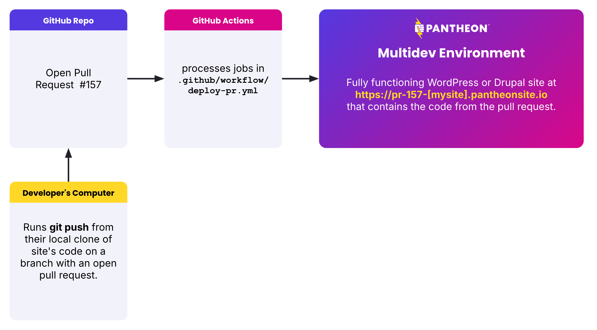
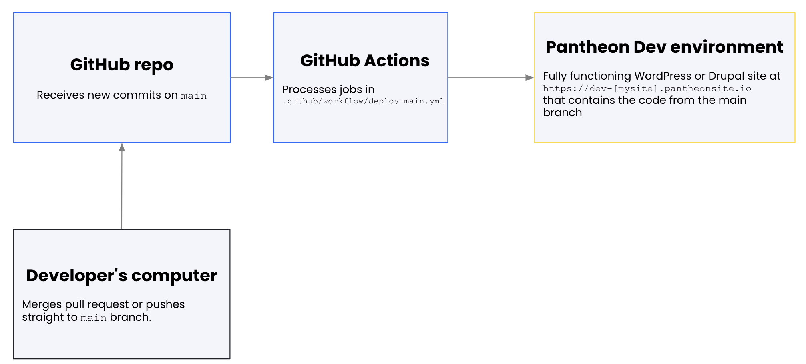
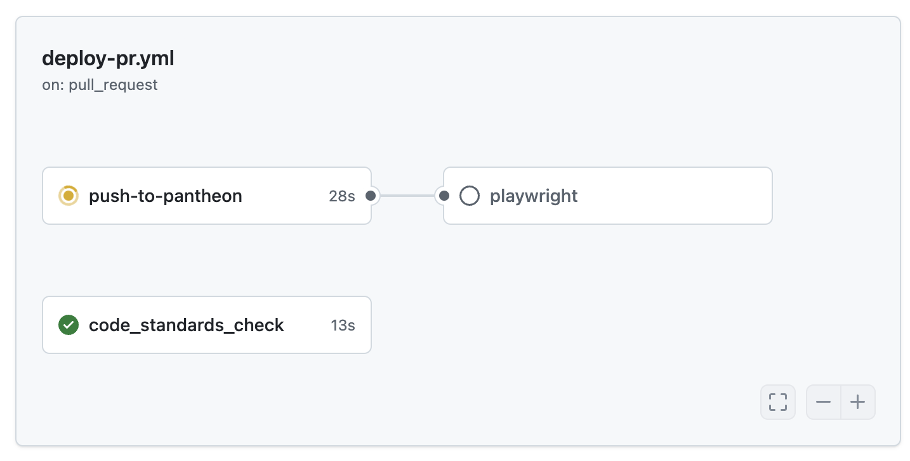

# Push Site to Pantheon (GitHub Action)

This GitHub Action pushes your site's code from GitHub to [the Pantheon `Dev` environment](https://docs.pantheon.io/pantheon-workflow) or [Multidev environment](https://docs.pantheon.io/guides/multidev).

It is designed to be used in GitHub Actions workflows that are triggered by Pull Requests and pushes to the `main` branch of your repository.

When running workflow triggered by a pull request, this action will create a [Multidev environment](https://docs.pantheon.io/guides/multidev) and deploy code to it.



When running on workflows triggered by merges/pushes to the `main` branch this action will deploy code to [the Pantheon `Dev` environment](https://docs.pantheon.io/pantheon-workflow).



## Basic Usage

This action provides a step that can be used as the only step within a job.
More complex examples further below show additional steps and jobs used in conjunction with this action.

Here is the beginning of a `jobs` section of [a real `.github/workflows/deploy-pr.yml` file](https://github.com/stevector/stevector-composed/blob/6a1c0183ef6e429761fcc090c34cfcc2dcd7c573/.github/workflows/deploy-pr.yml) that deploys a site to Pantheon when triggered by a Pull Request.


```
jobs:
  deploy:
    runs-on: ubuntu-latest
    steps:
    - name: Deploy to Pantheon
      uses: stevector-streaming/dtp@0.2.1
      with:
        ssh_key: ${{ secrets.PANTHEON_SSH_KEY }}
        machine_token: ${{ secrets.TERMINUS_MACHINE_TOKEN }}
        site: ${{ vars.PANTHEON_SITE }}
```

## Parameters

In order to use the step supplied by this Action, the GitHub Workflow must have access to [a token for authenticating with Pantheon's command line](https://docs.pantheon.io/machine-tokens) and [a private key](https://docs.pantheon.io/ssh-keys) that will allow Git pushes to Pantheon and other operations.
Both of those values should be treated senstively and stored as [GitHub Secrets](https://docs.github.com/en/actions/reference/encrypted-secrets).

The only other required argument is the machine name of the Pantheon site to which the code will be deployed.

The optional argument likely to be most commonly used is `delete_old_environments` which will delete Multidev environments associated with closed pull requests after the deployment completes. Setting `delete_old_environments: true` is recommended for workflows that run after merges to the `main` branch to avoid accumulating Multidev environments that are no longer needed.

### Required Arguments

#### `ssh_key`

[A private key that corresponds to a public key on Pantheon](https://docs.pantheon.io/ssh-keys).


#### `machine_token`

[A token for authenticating with Pantheon's command line](https://docs.pantheon.io/machine-tokens).


#### `site`

The machine name of your Pantheon site.

### Optional Arguments

#### `delete_old_environments`

If set to true, Multidev environments associated with closed pull requests will be deleted after deployment completes. It is recommended to set this parameter to true for workflows that run after merges to the main branch.

```yml
   default: false
   type: boolean
```

#### `target_env`
The Pantheon environment to which the deployment will be made. If left blank, the value used will be automatically derived. Pull requests will deploy to environments named `pr-${NUMBER}` and `main`/`master` branch commits will deploy to the Pantheon "dev" environment.

```yml
   default: ""
```

#### `source_env`

The environment from which the database and uploaded files will be copied.

```yml
   default: "live"
```

#### `clone_content`

If set to true, the database and files directory will be re-cloned from the source environment. When set to false, this data is only copied upon Multidev creations. Setting this variable to true ensures fresh content but adds time to the build process that can be prohibitive for sites with large databases.

```yml
   default: false
   type: boolean
```

#### `git_user_name`

The name to be used with the Git commit that will be pushed to Pantheon. This value is not used on newer 'eVCS' sites for which there is no Pantheon-provided Git repo.

```yml
   default: "GitHub Action Automation"
```

#### `git_user_email`
The email address to be used with the Git commit that will be pushed to Pantheon. This value is not used on newer 'eVCS' sites for which there is no Pantheon-provided Git repo.

```yml
   default: "GitHubAction@example.com"
```

#### `git_commit_message`
A custom commit message to be used with the Git commit that will be pushed to Pantheon. Leaving this Action parameter blank will result in a generic commit message being used. This value is not used on newer 'eVCS' sites for which there is no Pantheon-provided Git repo.

```yml
   default: ""
```

## Additional recommendations

### Pin exact version of this action prior to the release of version 1.0.0

Prior to the release of version 1.0.0, it is recommended to pin the version of this action to a specific version in your workflow file.
This will prevent breaking changes from being introduced to your workflow without your knowledge.
The most likely breaking change would be a change to the name of the action or the name of the inputs.
For instance is `delete_old_environments` the best name for that parameter?
[We might change it.](https://github.com/stevector-streaming/dtp/issues/53)

To pin the version of this action to a specific version, use the `@` symbol followed by the version number in the `uses` key of the step that uses this action.
For example, to use version 0.2.1 of this action, the step would look like this:

```yml
- name: Deploy to Pantheon
  uses: stevector-streaming/dtp@0.2.1
  with:
    ssh_key: ${{ secrets.PANTHEON_SSH_KEY }}
    machine_token: ${{ secrets.TERMINUS_MACHINE_TOKEN }}
    site: ${{ vars.PANTHEON_SITE }}
```

### Additional build steps like `composer install` and `npm build`

[_todo: explain_](https://github.com/stevector-streaming/dtp/issues/54)

### Concurrency

Sometimes in the course of development it is normal to push one commit to a branch with a pull request and then push another commit a minute later and then another. Similarly, a team might merge five pull requests in quick succession.
Depending on the nature of the project, the team might want relevant Workflows to be processed for every single commit.

However, for most WordPress and Drupal teams deploying to Pantheon we recommend running no more than one workflow on a branch at a time because this GitHub Action presumes (though does not strictly enforce) that all workflow runs on a given branch will deploy code to the same Pantheon environment.
Multiple workflows each attempting to deploy code to the same environment at the same time could result in confusing error states or failing automated tests that follow deployment.

To ensure that only one build runs at a time for a pull request, include this `concurrency` section in your workflow's yml file:


```yml
concurrency:
  group: ${{ github.workflow }}-${{ github.event.pull_request.number }}
  cancel-in-progress: false
```

For a workflow that handles only the main branch, that section could be altered to:

```yml
concurrency:
  group: ${{ github.workflow }}-main
  cancel-in-progress: false
```

### Using additional jobs to test your code and the deployed site

Unit tests and code sniffing/linting generally do not need a fully functioning site in order to execute.
Therefore you can run them in parallel with the job that pushes the site to Pantheon.
End to end tests that depend on a fully functioning site should wait for the job that pushes to complete so that the tests can run against the deployed site.

In this example, coding standards checks are run in parallel with the `push-to-pantheon` job and tests written in [Playwright](https://playwright.dev/) which check customized CMS functionality run after the deployment completes.

Here is an example from a real site that runs a coding standards check in parallel to the `push-to-pantheon` job.



Here is how those jobs are defined in an example site's `.github/workflows/deploy-pr.yml` file:

```yml

jobs:
  push-to-pantheon:
    runs-on: ubuntu-latest
    steps:
    - name: Deploy to Pantheon
      uses: stevector-streaming/dtp@0.2.1
      with:
        ssh_key: ${{ secrets.PANTHEON_SSH_KEY }}
        machine_token: ${{ secrets.TERMINUS_MACHINE_TOKEN }}
        site: ${{ vars.PANTHEON_SITE }}

  code_standards_check:
    runs-on: ubuntu-latest
    steps:
    - uses: actions/checkout@v2
    - name: Composer install
      run: composer install
    - name: Check coding standards
      run: composer run cs

  playwright:
    needs: push-to-pantheon
    runs-on: ubuntu-latest
    steps:
    - name: Check out the repository
      uses: actions/checkout@v2
    - uses: ./.github/actions/playwright-against-pantheon
      with:
        pantheon_ssh_key: ${{ secrets.PANTHEON_SSH_KEY }}
        terminus_machine_token: ${{ secrets.TERMINUS_MACHINE_TOKEN }}
        pantheon_site: ${{ vars.PANTHEON_SITE }}
```
