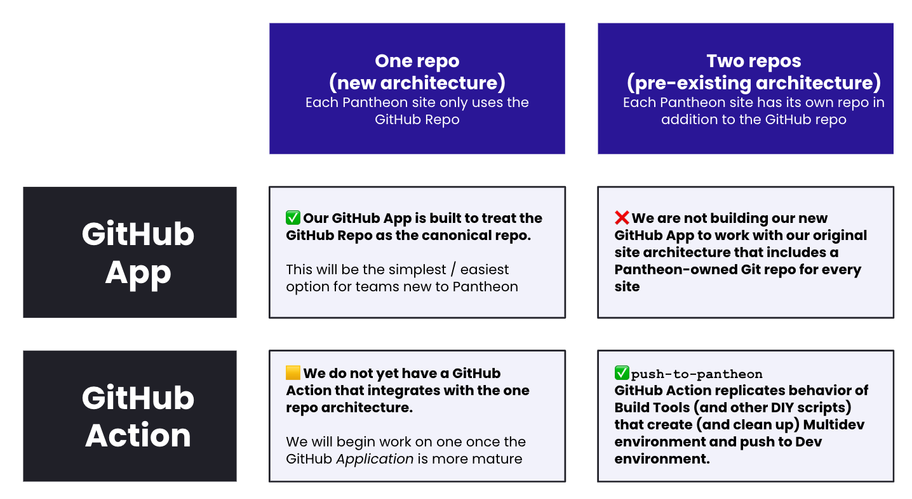
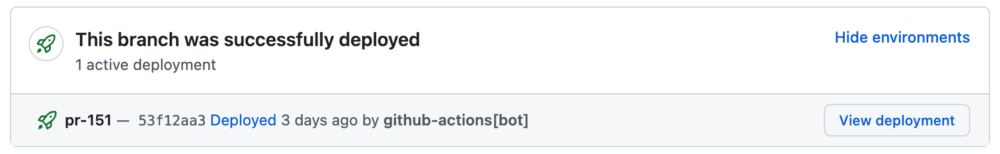

# Push to Pantheon (GitHub Action)

[](https://docs.pantheon.io/oss-support-levels#early-access)

This GitHub Action pushes your site's code from GitHub to [the Pantheon `Dev` environment](https://docs.pantheon.io/pantheon-workflow) or [Multidev environment](https://docs.pantheon.io/guides/multidev).

It is designed to be used in GitHub Actions workflows that are triggered by Pull Requests and pushes to the `main` branch of your repository.

When running workflow triggered by a pull request, this action will create a [Multidev environment](https://docs.pantheon.io/guides/multidev) and deploy code to it.


When running on workflows triggered by merges/pushes to the `main` branch this action will deploy code to [the Pantheon `Dev` environment](https://docs.pantheon.io/pantheon-workflow).


## Early Access

As a publicly available GitHub Action, there is no gating mechanism preventing any Pantheon customer from using the code in this repository. However, this reposistory is in active development and behaviors may change between versions. Only teams with pre-existing Continuous Integration pipelines that they could fall back to, should try this repository at this time. [See our documentation for more information about software maturity and support](https://docs.pantheon.io/oss-support-levels#early-access).

## Related Resources

- [Pantheon's GitHub Actions](https://docs.pantheon.io/github-actions)
- [GitHub Application](https://docs.pantheon.io/github-application)
- [Native GitHub workflows on Pantheon livestream recording](https://www.youtube.com/live/Wj9KoTqXwY0?si=1MQlHXDyjMVvWOyX)
- [Terminus GitHub Action](https://github.com/pantheon-systems/terminus-github-actions)

## Basic Usage

This action provides a step that can be used as the only step within a job.
More complex examples further below show additional steps and jobs used in conjunction with this action.

Here is the beginning of a `jobs` section of a site's `.github/workflows/deploy-pr.yml` file that deploys a site to Pantheon when triggered by a Pull Request.

```yml
jobs:
  push:
    permissions:
      deployments: write
      contents: read
      pull-requests: read
    runs-on: ubuntu-latest
    steps:
    - uses: actions/checkout@v4
    - name: Push to Pantheon
      uses: pantheon-systems/push-to-pantheon@0.6.1
      with:
        ssh_key: ${{ secrets.PANTHEON_SSH_KEY }}
        machine_token: ${{ secrets.PANTHEON_MACHINE_TOKEN }}
        site: ${{ vars.PANTHEON_SITE }}
```

## Inputs
<!-- AUTO-DOC-INPUT:START - Do not remove or modify this section -->

|          INPUT          |  TYPE  | REQUIRED |         DEFAULT         |                                                                                                                                                                                                                          DESCRIPTION                                                                                                                                                                                                                          |
|-------------------------|--------|----------|-------------------------|---------------------------------------------------------------------------------------------------------------------------------------------------------------------------------------------------------------------------------------------------------------------------------------------------------------------------------------------------------------------------------------------------------------------------------------------------------------|
|      clone_content      | string |  false   |        `"false"`        |                                                     If set to true, the database <br>and files directory will be re-cloned <br>from the source environment. When set <br>to false, this data is only <br>copied upon Multidev creations. Setting this <br>variable to true ensures fresh content <br>but adds time to the build <br>process that can be prohibitive for <br>sites with large databases.                                                       |
| delete_old_environments | string |  false   |        `"false"`        |                                                                                                      If set to true, Multidev environments <br>associated with closed pull requests will <br>be deleted after deployment completes. It <br>is recommended to set this parameter <br>to true for workflows that run <br>after merges to the main branch.                                                                                                       |
|   git_commit_message    | string |  false   |                         |                                                                          A custom commit message to be <br>used with the Git commit that <br>will be pushed to Pantheon. Leaving <br>this Action parameter blank will result <br>in a generic commit message being <br>used. This value is not used <br>on newer 'eVCS' sites for which <br>there is no Pantheon-provided Git repo.                                                                           |
|     git_user_email      | string |  false   | `"bot@getpantheon.com"` |                                                                                                                             The email address to be used <br>with the Git commit that will <br>be pushed to Pantheon. This value <br>is not used on newer 'eVCS' <br>sites for which there is no <br>Pantheon-provided Git repo.                                                                                                                              |
|      git_user_name      | string |  false   | `"Pantheon Automation"` |                                                                                                                                 The name to be used with <br>the Git commit that will be <br>pushed to Pantheon. This value is <br>not used on newer 'eVCS' sites <br>for which there is no Pantheon-provided <br>Git repo.                                                                                                                                   |
|      machine_token      | string |   true   |                         |                                                                                                                                                                             A token for authenticating with Pantheon's <br>command line: https://docs.pantheon.io/machine-tokens                                                                                                                                                                              |
|   relative_site_root    | string |  false   |                         |                                                                                  The root directory of the site <br>to be deployed relative to the <br>repository root. The vast majority of <br>users of this action should leave <br>this value unchanged from the default. <br>The action will use this value <br>to change directories after checking out <br>the repo.                                                                                   |
|          site           | string |   true   |                         |                                                                                                                                                                                                         The machine name of your Pantheon <br>site.                                                                                                                                                                                                           |
|  skip_terminus_install  | string |  false   |        `"false"`        | If set to true, the action <br>will skip the installation of Terminus. <br>This is useful if you are <br>using a custom Docker image that <br>already has Terminus installed or you <br>are installing it earlier in the <br>workflow. By default, the action will <br>check for the presence of Terminus <br>and install it if it is <br>not found, but if this is <br>set to true, the action will <br>bypass the check and skip the <br>Terminus install.  |
|       source_env        | string |  false   |        `"live"`         |                                                                                                                                                                                        The environment from which the database <br>and uploaded files will be copied.                                                                                                                                                                                         |
|         ssh_key         | string |   true   |                         |                                                                                                                                                                              A private key that corresponds to <br>a public key on Pantheon: https://docs.pantheon.io/ssh-keys                                                                                                                                                                                |
|       target_env        | string |  false   |                         |                                                                                The Pantheon environment to which the <br>deployment will be made. If left <br>blank, the value used will be <br>automatically derived. Pull requests will deploy <br>to environments named "pr-[NUMBER]" and main/master <br>branch commits will deploy to the <br>Pantheon "dev" environment                                                                                 |

<!-- AUTO-DOC-INPUT:END -->

## Parameters

In order to use the step supplied by this Action, the GitHub Workflow must have access to [a token for authenticating with Pantheon's command line](https://docs.pantheon.io/machine-tokens) and [a private key](https://docs.pantheon.io/ssh-keys) that will allow Git pushes to Pantheon and other operations.
Both of those values should be treated sensitively and stored as [GitHub Secrets](https://docs.github.com/en/actions/reference/encrypted-secrets).

The only other required argument is the machine name of the Pantheon site to which the code will be pushed.

The optional argument likely to be most commonly used is `delete_old_environments` which will delete Multidev environments associated with closed pull requests after the deployment completes. Setting `delete_old_environments: true` is recommended for workflows that run after merges to the `main` branch to avoid accumulating Multidev environments that are no longer needed.

### Required Arguments

#### `ssh_key`

[A private key that corresponds to a public key on Pantheon](https://docs.pantheon.io/ssh-keys).

#### `machine_token`

[A token for authenticating with Pantheon's command line](https://docs.pantheon.io/machine-tokens).

#### `site`

The machine name of your Pantheon site.

### Optional Arguments

#### `delete_old_environments`

If set to true, Multidev environments associated with closed pull requests will be deleted after deployment completes. It is recommended to set this parameter to true for workflows that run after merges to the main branch.

```yml
   default: false
   type: boolean
```

#### `target_env`
The Pantheon environment to which the deployment will be made. If left blank, the value used will be automatically derived. Pull requests will deploy to environments named `pr-${NUMBER}` and `main`/`master` branch commits will deploy to the Pantheon "dev" environment.

```yml
   default: ""
```

#### `source_env`

The environment from which the database and uploaded files will be copied.

```yml
   default: "live"
```

#### `clone_content`

If set to true, the database and files directory will be re-cloned from the source environment. When set to false, this data is only copied upon Multidev creations. Setting this variable to true ensures fresh content but adds time to the build process that can be prohibitive for sites with large databases.

```yml
   default: false
   type: boolean
```

#### `git_user_name`

The name to be used with the Git commit that will be pushed to Pantheon. This value is not used on newer 'eVCS' sites for which there is no Pantheon-provided Git repo.

```yml
   default: "GitHub Action Automation"
```

#### `git_user_email`
The email address to be used with the Git commit that will be pushed to Pantheon. This value is not used on newer 'eVCS' sites for which there is no Pantheon-provided Git repo.

```yml
   default: "GitHubAction@example.com"
```

#### `git_commit_message`
A custom commit message to be used with the Git commit that will be pushed to Pantheon. Leaving this Action parameter blank will result in a generic commit message being used. This value is not used on newer 'eVCS' sites for which there is no Pantheon-provided Git repo.

```yml
   default: ""
```

#### `relative_site_root`
The root directory of the site to be deployed relative to the repository root. The vast majority of users of this action should leave this value unchanged from the default. The action will use this value to change directories after checking out the repo.

```yml
   default: ""
```

#### `skip_terminus_install`
If set to true, the action will skip installing Terminus. This is useful if you are using this action in a workflow that already has Terminus installed, such as the [Terminus GitHub Action](https://github.com/pantheon-systems/terminus).

```yml
   default: false
   type: boolean
```

## Additional recommendations

### Pin exact version of this action prior to the release of version 1.0.0

Prior to the release of version 1.0.0, it is recommended to pin the version of this action to a specific version in your workflow file.
This will prevent breaking changes from being introduced to your workflow without your knowledge.
The most likely breaking change would be a change to the name of the action or the name of the inputs.
For instance is `delete_old_environments` the best name for that parameter?
[We might change it.](https://github.com/pantheon-systems/push-to-pantheon/issues/6)

To pin the version of this action to a specific version, use the `@` symbol followed by the version number in the `uses` key of the step that uses this action.
For example, to use version 0.4.1 of this action, the step would look like this:

```yml
- name: Push to Pantheon
  uses: pantheon-systems/push-to-pantheon@0.4.1
  with:
    ssh_key: ${{ secrets.PANTHEON_SSH_KEY }}
    machine_token: ${{ secrets.PANTHEON_MACHINE_TOKEN }}
    site: ${{ vars.PANTHEON_SITE }}
```

## Pushing from a GitHub repository to a Pantheon-hosted repository

Pantheon provides a Git repository for each site hosted on our platform.
This assumption allows teams to use Git without paying for a separate Git hosting service.
However, many teams prefer to use third-party repositories like GitHub as their Git hosting service.

This Action is designed to work with those workflows where the Git repository is hosted on GitHub and pushing from GitHub to Pantheon.
If you are interested in a native integration with GitHub that _only_ uses a single repository hosted on GitHub via a [GitHub Application](https://docs.pantheon.io/github-application), you may [request access to the private beta](https://docs.google.com/forms/d/e/1FAIpQLSf0vYrRbPQBxR-hT8kGJ4bEdYPtpkTtfDvPM89xD2dNZeqLqA/viewform).



### Additional build steps like `composer install` and `npm build`

By default this action will check out the code from the GitHub repository and push it to Pantheon.
For many WordPress sites and Drupal sites, this is all that is needed.
By setting [`build_step: true` in the `pantheon.yml`](https://docs.pantheon.io/pantheon-yml#integrated-composer-build-step), Pantheon will execute `composer install` and eventually `npm build` for compilation of CSS and JS assets needed for a theme.

However, some teams prefer to do these build steps in GitHub Actions before pushing to Pantheon.

That use case can be accommodated by adding additional steps to the workflow before the step that uses this action.

Here's an example from a real site that uses Tailwind to prepare CSS in the site's custom theme.

```yml
  push-to-pantheon:
    runs-on: ubuntu-latest
    steps:
    - uses: actions/checkout@v4
    # The custom theme for this site uses Tailwind to build the
    # appropriate CSS file.
    - run: "cd web/themes/my_custom_theme && npm ci && npm run build"
    # Deleting this small .gitignore that ignores compiled CSS
    # from the GitHub repo will allow it to be committed and pushed
    # to Pantheon in the later "push-to-pantheon" step.
    - run: "cd web/themes/my_custom_theme/css && rm .gitignore"
    - name: Push to Pantheon
      uses: pantheon-systems/push-to-pantheon@0.6.1
      with:
        ssh_key: ${{ secrets.PANTHEON_SSH_KEY }}
        machine_token: ${{ secrets.PANTHEON_MACHINE_TOKEN }}
        site: ${{ vars.PANTHEON_SITE }}
```

By calling `npm run build` and modifying `gitignore` prior to calling `push-to-pantheon`, the Tailwind-generated CSS (which is not wanted in the GitHub repo) is available to be committed (and pushed) inside the `push-to-pantheon` step.

### Permissions

This action needs permission to perform its work. Set the following permissions either at the level of the workflow or at the level of the job that uses this action.

```yml
    permissions:
      deployments: write
      contents: read
      pull-requests: read
```

The `deployments: write` permission is required to notify GitHub that the deployment has been made (to a Pantheon Multidev usually).
This is required for the GitHub UI to show the deployment status of the pull request:



The `contents: read` permission is required for the job to check out the code from the GitHub repository.
Even though this action does not checkout of the code itself, the code must be checked out prior to this step in order for the action to work.

The `pull-requests: read` permission is required to delete old Multidev environments associated with closed pull requests.

[See the GitHub Actions documentation for more information on permissions.](https://docs.github.com/en/actions/writing-workflows/choosing-what-your-workflow-does/controlling-permissions-for-github_token)

### Using this action with robots (like Dependabot)

When using this action with robots like [Dependabot](https://docs.github.com/en/code-security/supply-chain-security/keeping-your-dependencies-updated-automatically/about-dependency-updates), it is important to ensure that the workflow has access to the secrets needed to push to Pantheon.
This is because robots like Dependabot create pull requests from forks of the repository, and GitHub does not allow secrets to be used in workflows triggered by pull requests from forks for security reasons.
To work around this, you can use the `pull_request_target` event instead of the `pull_request` event combined with a two-step checkout process that ensures that the code being executed is from the base repository, not the fork.

Here is an example of how to set up a workflow that uses this action with Dependabot:

```yml
name: Deploy PR to Pantheon
on:
  pull_request_target:
    types: [opened, synchronize, reopened]
jobs:
  push:
    permissions:
      deployments: write
      contents: write # needed to checkout the PR code.
      pull-requests: read
    runs-on: ubuntu-latest
    steps:
    # Checkout the base repository code into the root directory.
    # This is the code that will be used to run the workflow.
    - name: Checkout base repository code
      uses: actions/checkout@v4

    # Checkout the pull request code into a subdirectory.
    # This is the code that will be deployed.
    - name: Checkout PR code
      uses: actions/checkout@v4
      with:
        repository: ${{ github.event.pull_request.head.repo.full_name }}
        ref: ${{ github.event.pull_request.head.ref }}
        path: pr-code
    - name: Push to Pantheon
      uses: pantheon-systems/push-to-pantheon@0.6.1
      with:
        ssh_key: ${{ secrets.PANTHEON_SSH_KEY }}
        machine_token: ${{ secrets.MACHINE_TOKEN }}
        site: ${{ vars.PANTHEON_SITE }}
        relative_site_root: pr-code
```

### Concurrency

Sometimes in the course of development it is normal to push one commit to a branch with a pull request and then push another commit a minute later and then another. Similarly, a team might merge five pull requests in quick succession.
Depending on the nature of the project, the team might not want Workflows to be processed for every single commit.
In addition, when multiple GitHub Workflows run concurrently, the subsequent pushes to the Pantheon environment may fail anyway, because Pantheon only supports a single `sync_code` workflow to run at a time.

To ensure that only one build runs at a time for a pull request, include this `concurrency` section in your workflow's yml file:

```yml
concurrency:
  group: ${{ github.workflow }}-${{ github.event.pull_request.number }}
  cancel-in-progress: true
```

For a workflow that handles only the main branch, that section could be altered to:

```yml
concurrency:
  group: ${{ github.workflow }}-main
  cancel-in-progress: true
```

**Note:** Cancelled workflows do not necessarily immediately halt all operations, for example when Terminus triggers a workflow to run. This can sometimes result in confusing error states or failed automated tests. In most cases, a subsequent push will resolve the conflict but it is nevertheless recommended to avoid pushing many commits in quick succession.

### Using additional jobs to test your code and the deployed site

Unit tests and code sniffing/linting generally do not need a fully functioning site in order to execute.
Therefore you can run them in parallel with the job that pushes the site to Pantheon.
End to end tests that depend on a fully functioning site should wait for the job that pushes to complete so that the tests can run against the deployed site.

In this example, coding standards checks are run in parallel with the `push-to-pantheon` job and tests written in [Playwright](https://playwright.dev/) which check customized CMS functionality run after the deployment completes.

Here is an example from a real site that runs a coding standards check in parallel to the `push-to-pantheon` job.


Here is how those jobs are defined in an example site's `.github/workflows/deploy-pr.yml` file:

```yml
jobs:
  push-to-pantheon:
    runs-on: ubuntu-latest
    steps:
    - name: Deploy to Pantheon
      uses: pantheon-systems/push-to-pantheon@0.6.1
      with:
        ssh_key: ${{ secrets.PANTHEON_SSH_KEY }}
        machine_token: ${{ secrets.PANTHEON_MACHINE_TOKEN }}
        site: ${{ vars.PANTHEON_SITE }}

  code_standards_check:
    runs-on: ubuntu-latest
    steps:
    - uses: actions/checkout@v2
    - name: Composer install
      run: composer install
    - name: Check coding standards
      run: composer run cs

  playwright:
    needs: push-to-pantheon
    runs-on: ubuntu-latest
    steps:
    - name: Check out the repository
      uses: actions/checkout@v2
    - uses: ./.github/actions/playwright-against-pantheon
      with:
        ssh_key: ${{ secrets.PANTHEON_SSH_KEY }}
        machine_token: ${{ secrets.PANTHEON_MACHINE_TOKEN }}
        pantheon_site: ${{ vars.PANTHEON_SITE }}
```

## Custom Upstreams

This action is not intended for use in upstream management (e.g. deploying changes to _many_ sites that use a specific custom upstream). In the future, an additional workflow may be added to support this, but this is not currently on the roadmap for a 1.0.0 release.

In the meantime, if you are looking for a GitHub action to manage sites that use custom upstreams, you can look at these example workflows that are built for that purpose:

* https://github.com/danny2p/wp-standard/blob/master/.github/workflows/2-deploy-dev.yml
* https://github.com/jazzsequence/plague-music-wp-upstream/blob/main/.github/workflows/deploy-dev.yml

PRs are always welcome! You can track updates for this feature in the [associated GitHub issue](https://github.com/pantheon-systems/push-to-pantheon/issues/70).